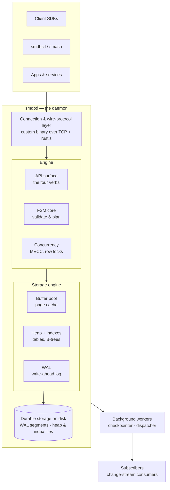
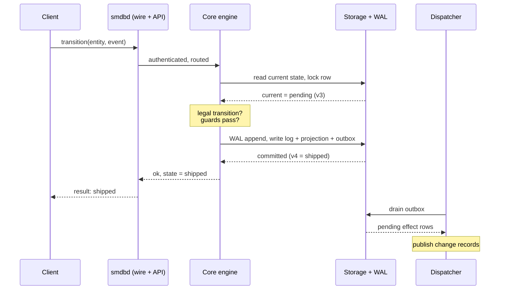
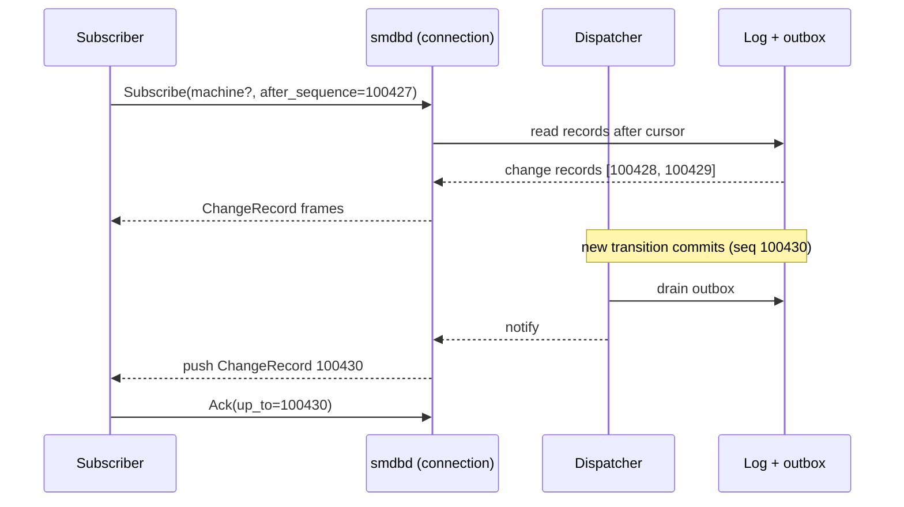

# StateMaster

> A state-machine database. One job, done exceptionally well: own the lifecycle of every entity — validate transitions, enforce guards, and remember everywhere each entity has been.

**Status:** pre-v1 · **Doc type:** living document · **Revision:** 5 · **Owner:** core team
**Last updated:** 2026-06-01

This file is the single source of truth for what StateMaster is, where it's going, and what ships in v1. It is meant to be edited continuously. When a decision changes, update the relevant section and add an entry to the [Decisions log](#decisions-log).

**New in r5:** library crates renamed to the `smdb-` prefix to match the binaries; binaries unchanged (`smdbd` / `smdbctl` / `smash`).

---

## Table of contents

1. [Vision & North Star](#vision--north-star)
2. [What StateMaster is / is not](#what-statemaster-is--is-not)
3. [Core concepts](#core-concepts)
4. [Examples & where it shines](#examples--where-it-shines)
5. [Architecture](#architecture)
6. [Transition lifecycle](#transition-lifecycle)
7. [Data model](#data-model)
8. [Storage engine](#storage-engine)
9. [API surface & wire protocol](#api-surface--wire-protocol)
10. [Client connection](#client-connection)
11. [Change records & change stream](#change-records--change-stream)
12. [Concurrency & consistency](#concurrency--consistency)
13. [Deployment & operations](#deployment--operations)
14. [Observability](#observability)
15. [Security](#security)
16. [Clients, drivers & tooling](#clients-drivers--tooling)
17. [Tech stack & repo layout](#tech-stack--repo-layout)
18. [Roadmap](#roadmap)
19. [v1 launch checklist](#v1-launch-checklist)
20. [Non-goals (for v1)](#non-goals-for-v1)
21. [Decisions log](#decisions-log)
22. [Open questions](#open-questions)
23. [Glossary](#glossary)

---

## Vision & North Star

The lifecycle of a domain object is one of the most important and most poorly-served concerns in software. Today it's smeared across an ad-hoc `status` column, scattered `if` statements, a half-finished workflow engine, and a pile of audit triggers nobody trusts. StateMaster's bet is that **state is a first-class thing worth its own database**, the way documents got MongoDB and time series got InfluxDB.

**North Star:** a horizontally-scalable, distributed state-machine database that becomes the default home for entity lifecycles — the obvious thing you reach for when an entity has states, transitions, and rules about how it moves between them. Standalone daemon, its own storage engine, its own wire protocol, first-class SDKs.

This is a multi-year arc. The doc deliberately separates the North Star from a shippable v1 so ambition doesn't stall delivery. We earn the right to be "big" by first being unmistakably good at one node.

---

## What StateMaster is / is not

**Is:**
- A database whose unit of data is *an entity's position in one or more state machines*.
- The authority that grants or rejects transitions — callers fire events, StateMaster decides the outcome.
- An append-only history of every transition, with the current state as a fast projection over that history.
- A change stream: a successful transition can emit effects that other systems react to.

**Is not:**
- A general-purpose document or relational store. It holds lifecycle state, not your entity's full domain data.
- A workflow orchestrator with long-running tasks and human approvals baked in (that can be built *on top of* StateMaster, but it is not the core).
- A message queue, though the outbox/change-stream gives it queue-adjacent powers.

---

## Core concepts

- **Entity** — anything with a lifecycle, identified by an opaque `entity_id`. StateMaster does not own the entity's domain data, only its state.
- **Machine** — a named state-machine definition: the set of valid states and the transition table (which `event` moves you from which state to which state), plus guards.
- **State** — where an entity currently sits within a machine.
- **Event** — the thing a caller fires (`"ship"`, `"approve"`, `"cancel"`). The caller names the *event*, never the target state. The engine computes the target.
- **Transition** — an immutable, logged record of one state change: `from → to`, the event, the actor, a timestamp, and arbitrary context.
- **Guard** — a predicate that must pass for a transition to be allowed (e.g. "can only ship if payment captured").
- **Effect** — a side effect emitted on a successful transition, written to the outbox and published by the dispatcher. Never fired inline.
- **Projection** — the materialized `current_state` per `(entity, machine)`, kept in lockstep with the log inside the same transaction. The log is truth; the projection is a cache for cheap reads.
- **Change record** — the published representation of a committed transition plus the effects it emitted. The unit of the change stream.

**Key property — multiple concurrent machines per entity.** State is keyed by `(entity_id, machine)`, so one `Order` can simultaneously run a fulfillment machine, a payment machine, and a fraud-review machine, each with its own independent position. This is awkward to model as a single `status` column and is a core reason state deserves its own store.

---

## Examples & where it shines

StateMaster owns *the lifecycle dimension* of your entities. It is complementary to your primary datastore, not a replacement for it: your domain data lives in your RDBMS / document store, and StateMaster is the authority for where each entity sits in its lifecycle, the rules for moving, the history of moves, and the feed other systems react to.

### Worked example — order fulfillment

Define the machine once (definition format is an open question — see [Open questions](#open-questions) — this is illustrative):

```text
machine "fulfillment" v1:
  states:      pending, paid, packed, shipped, delivered, canceled
  transitions:
    pay:     pending                  -> paid
    pack:    paid                     -> packed     [guard: inventory_reserved]
    ship:    packed                   -> shipped    [guard: payment_captured]
    deliver: shipped                  -> delivered
    cancel:  pending | paid | packed  -> canceled
  effects:
    on ship:    notify(customer, template="shipped")
    on cancel:  release_inventory
```

Then drive it:

```text
transition order_8412 fulfillment pay                 -> paid (v2)
transition order_8412 fulfillment pack                -> rejected: guard_failed (inventory_reserved)
transition order_8412 fulfillment ship                -> shipped (v4), emits change record + notify effect
current     order_8412 fulfillment                    -> { state: shipped, version: 4 }
history     order_8412 fulfillment                    -> [pending->paid, paid->packed, packed->shipped]
subscribe   machine=fulfillment after_sequence=0      -> stream of change records
```

Downstream, three independent consumers read the same change stream: the inventory service decrements stock on `packed`, the email service sends on `shipped`, analytics ingests everything. Meanwhile the same order runs a separate `payment` machine and a `fraud_review` machine concurrently — three lifecycles on one entity, each with its own state and history.

### More scenarios

- **Subscription billing.** `trial -> active -> past_due -> canceled -> churned`. Guards stop `active` without a payment method; a scheduler fires time-based transitions (`trial` expiry, dunning). Every change is auditable for compliance, and the change stream drives dunning emails and access revocation.
- **Content moderation / approval.** `draft -> submitted -> in_review -> approved | rejected -> published`. Role-based guards mean only a reviewer can fire `approve`; the immutable history answers "who approved this, and when" for audit; rejections carry a reason in `ctx`.
- **IoT device fleet.** `provisioned -> online -> degraded -> offline -> decommissioned` across millions of devices, each also running a concurrent `firmware_update` machine. Transitions are event-driven from heartbeats; the change stream feeds alerting and dashboards.
- **Support / incident lifecycle.** `open -> triaged -> in_progress -> resolved -> closed` with SLA timers and a clean audit trail of every status change and who made it.

### Where it shines

The comparison is specifically about the *lifecycle concern*. The other systems store data well; they treat lifecycle as a manual add-on.

| Capability | StateMaster | RDBMS + `status` col | Document store | Graph DB | Workflow engine |
|---|---|---|---|---|---|
| Enforce legal transitions per event | native | triggers/CHECK (drifts) | app code | stores edges, doesn't enforce | in workflow code |
| Reject an illegal move at write time | yes | partial | no | no | yes |
| Intrinsic immutable history / audit | yes | build (audit triggers) | build (audit coll.) | partial | yes (event history) |
| Guards (conditional transitions) | yes | app/triggers | app code | app code | yes |
| Atomic transition + emitted effects | yes (outbox) | build (outbox) | build | build | yes |
| Validated change feed (from/to/event/actor, ordered) | yes | build (NOTIFY + outbox) | deltas only, not lifecycle | no | partial |
| Current state w/ optimistic concurrency | yes | hand-rolled `UPDATE…WHERE version` | hand-rolled | n/a | managed |
| Multiple concurrent machines per entity | native | awkward (many columns) | awkward (fields) | manual | multiple workflows |
| Query "all entities in state X" | yes (it's a DB) | yes | yes | yes | hard (not a query store) |
| Stores your domain data | no (lifecycle only) | yes | yes | yes (as graph) | no |

**vs RDBMS (Postgres / MySQL).** The status quo is a `status` enum, CHECK constraints, audit triggers, and transition logic scattered through application code. An RDBMS can't natively express "for event `ship`, only `packed -> shipped` is legal" — you bolt it on with triggers and constraints that drift out of sync with the code. StateMaster makes the transition table the single declared authority, gives you trustworthy history for free, and ships the change feed as a first-class thing instead of a hand-built LISTEN/NOTIFY + outbox. You still keep the RDBMS for the entity's actual data, joins, and reporting — they're complementary.

**vs document stores / NoSQL (MongoDB, DynamoDB).** A document store will happily let you set `state` to anything; there is no notion that the move was legal. StateMaster rejects illegal transitions at write time. And while MongoDB has change streams, they emit *document deltas* (this field changed), not *validated lifecycle transitions* with from/to/event/actor semantics — a different and weaker contract for "what happened in the lifecycle." Use the document store for flexible payloads and scale of arbitrary documents; use StateMaster for the lifecycle.

**vs graph databases (Neo4j, etc.).** States and transitions *look* like a graph, so people reach for one. But a graph DB stores the *definition* as a graph — it does not *run* the machine: it won't constrain entity X to legal edges, won't track per-entity current state with optimistic concurrency, and won't emit a validated transition stream. Graph DBs are for relationship queries and traversals; StateMaster is the runtime authority over many entities' positions.

**vs workflow engines (Temporal, Camunda, Step Functions).** This is the closest neighbor. Workflow engines orchestrate long-running, multi-step *process executions* with durable code, timers, retries, and human tasks. StateMaster is *data-centric*: a queryable database of entity states, not an orchestrator of executions. It's lighter, you can ask it "show me every entity in state X," and it scales like a database. Reach for a workflow engine to coordinate a complex saga; reach for StateMaster as the system-of-record for *what state each entity is in* — a complex workflow can even use StateMaster underneath as its state-of-record.

### Reach for it when / skip it when

**Reach for it when** an entity has a real lifecycle — a defined set of states, rules about legal moves, a need for an auditable history of those moves, and other systems that must react when they happen — and you're tired of reimplementing that with a status column, a pile of triggers, an audit table, and scattered `if` statements.

**Skip it when** your "state" is a flat enum with no transition rules, nobody audits it, and nothing reacts to changes — a column is fine. And remember it is never your only datastore: domain data still lives elsewhere.

---

## Architecture

`smdbd` is a single binary that runs as a daemon. Clients connect over a custom binary wire protocol; the engine validates and plans transitions; the storage engine makes them durable using its own implementation of WAL, buffer pool, heap, and B-tree indexes.



**Component responsibilities**

- **Connection & wire-protocol layer** — accepts client connections on `:7632`, terminates TLS (`rustls`), runs the handshake, manages stateful sessions, decodes framed binary messages, applies backpressure.
- **API surface** — the four verbs (`define_machine`, `transition`, `current`, `history`) and their request/response types.
- **FSM core** — pure logic: looks up `(current_state, event)` in the machine definition, runs guards, decides the target or rejects. Has no knowledge of how it was invoked or how data is persisted (testable in isolation).
- **Concurrency control** — per-entity isolation so two transitions on the same entity can't corrupt the lifecycle. MVCC-style versioning plus row-level locking.
- **Storage engine** — buffer pool (page cache over the heap), heap files for tables, B-tree indexes, and the WAL for durability. Postgres concepts, our own Rust implementation (see [Storage engine](#storage-engine)).
- **Background workers** — the *checkpointer* (flush dirty pages, truncate WAL) and the *dispatcher* (drain the outbox and publish change records to subscribers).

---

## Transition lifecycle

A single `transition` call, traced across every component. Two round trips into storage: read-and-lock the current state, then commit the log + projection + outbox atomically.



The whole write path, in pseudocode, runs inside one storage transaction:

```text
BEGIN
  cur = read(entity_id, machine) WITH LOCK        -- + version check
  target = definition.lookup(cur.state, event)    -- illegal? -> reject, ROLLBACK
  if not guards.pass(cur, ctx): ROLLBACK          -- guard failed -> reject
  wal.append(transition_record)                   -- durability first
  log.insert(transition_record)                   -- append-only, source of truth
  projection.upsert(current_state = target, version + 1)
  outbox.insert(effects)                          -- NOT fired inline
COMMIT
-- dispatcher later drains outbox and publishes change records
```

Reads (`current`, `history`) bypass the write path entirely: `current` hits the projection, `history` scans the log. Only `transition` takes locks.

---

## Data model

Conceptual tables (physical layout is the storage engine's concern):

| Table | Purpose | Key columns |
|---|---|---|
| `machines` | Registered machine definitions | `name`, `version`, `definition`, `created_at` |
| `entity_state` | The projection — current position per entity per machine | `entity_id`, `machine`, `current_state`, `version`, `updated_at` |
| `transitions` | Append-only log — **source of truth** | `id`, `sequence`, `entity_id`, `machine`, `from_state`, `to_state`, `event`, `actor`, `ctx`, `ts` |
| `outbox` | Effects awaiting publication | `id`, `transition_id`, `payload`, `status`, `created_at` |

Notes:
- `entity_state` is keyed by `(entity_id, machine)` to support multiple concurrent machines per entity.
- `version` on `entity_state` powers optimistic concurrency and is bumped on every transition.
- `sequence` on `transitions` is a monotonic, gap-free global counter that doubles as the change-stream offset (see [Change records](#change-records--change-stream)).
- A machine `definition` is data, not code. Guards/effects that need real logic are registered handlers referenced by name from the definition.
- Indexes needed at minimum: `entity_state(entity_id, machine)` (unique), `transitions(entity_id, machine, ts)`, `transitions(sequence)` (unique), `outbox(status, created_at)`.

---

## Storage engine

We build our own storage engine in Rust, using the same concepts that make Postgres durable and concurrent — **we do not depend on or embed Postgres**. The concepts we adopt:

- **Write-ahead log (WAL)** — every change is appended to the WAL and fsync'd before the data pages are considered durable. Recovery replays the WAL from the last checkpoint.
- **Buffer pool** — an in-memory page cache over the heap, with eviction (clock/LRU) and dirty-page tracking.
- **Heap + page layout** — fixed-size pages holding tuples, slotted-page structure, free-space management.
- **B-tree indexes** — for primary keys and the secondary lookups above.
- **MVCC** — multiple versions of a row so readers never block writers; visibility determined by transaction state.
- **Checkpointing** — periodically flush dirty pages and truncate the WAL to bound recovery time.

### Phasing — the storage engine is the long pole

A correct, performant MVCC storage engine with crash recovery is the single largest piece of work here and the most likely thing to sink the v1 timeline. To avoid that, the build is phased, and **how v1 persists is an open decision** (see [Decisions log: D-002](#decisions-log)):

- **Option A — embedded Rust storage crate for v1.** Stand on a mature embedded engine (e.g. `redb` or `sled`) to get durability and indexing immediately, ship v1, and swap in the custom engine behind a `StorageEngine` trait later. Fastest path to launch; does not compromise the North Star because the interface is ours.
- **Option B — custom engine from day one.** Build WAL + buffer pool + heap + B-tree before v1 ships. True to the "all our own" stance but materially slower and riskier to launch.

**Recommendation captured in the doc, decision still open:** define a clean `StorageEngine` trait now, implement Option A first to validate the FSM semantics and wire protocol end-to-end, and treat the custom engine as a tracked phase 2 deliverable. The trait is the seam that keeps both options on the table.

---

## API surface & wire protocol

The four verbs:

```text
define_machine(name, version, definition)        -> machine_ref
transition(entity_id, machine, event, ctx)       -> { state, version } | rejection
current(entity_id, machine)                       -> { state, version, updated_at }
history(entity_id, machine, range?)               -> [ transition_record ]
```

Design rules:
- `transition` takes an **event**, never a target state. The engine is the arbiter.
- `transition` accepts an optional `expected_version` for optimistic concurrency; mismatch is a conflict, not a silent overwrite.
- Rejections are typed and explicit: `illegal_transition`, `guard_failed`, `version_conflict`, `unknown_machine`, `unknown_entity`.
- All transitions are idempotent on a client-supplied `idempotency_key` to make retries safe.

**Wire protocol (decided — [D-003](#decisions-log)):** a **custom binary protocol over plain TCP**, TLS via `rustls`. No Google tech — no gRPC, protobuf, or HTTP/2. Length-prefixed, type-tagged frames with **MessagePack** bodies; a stateful session established by a handshake; async server push for the change stream over the same connection. Full shape in [Client connection](#client-connection).

---

## Client connection

How a client talks to `smdbd`: one persistent, stateful connection with typed binary messages flowing both ways — the Postgres model, none of the Google tech.

### Connection model

- **Transport:** a single long-lived **TCP** connection per client (pooled), TLS via **`rustls`**.
- **Framing:** every message is a frame — `[1-byte type tag][4-byte big-endian length][body]`. Bodies are **MessagePack** (binary, type-rich, multi-language, no IDL/codegen toolchain).
- **Session:** the connection is stateful. After the handshake it holds identity, negotiated capabilities, and subscription cursors.
- **Correlation & async push:** each command carries a `request_id`; replies echo it, so clients can pipeline (send many before reading). Pushed change records carry a `subscription_id`, so command replies and async events interleave cleanly on the one connection.

### Frame types

Client → server:

| Tag | Message | Purpose |
|---|---|---|
| `Startup` | protocol version + capabilities | open negotiation |
| `Auth` | token | authenticate the session |
| `DefineMachine` | name, version, definition | register a machine |
| `Transition` | entity_id, machine, event, expected_version, ctx, idempotency_key | fire an event |
| `Current` | entity_id, machine | read current state |
| `History` | entity_id, machine, range | read the log |
| `Subscribe` | filter, after_sequence, subscription_id | start a change stream |
| `Ack` | subscription_id, up_to_sequence | advance a cursor |
| `Unsubscribe` | subscription_id | stop a stream |
| `Ping` / `Terminate` | — | keepalive / close |

Server → client:

| Tag | Message | Purpose |
|---|---|---|
| `Ready` | session_id, server version, capabilities | handshake complete |
| `AuthOk` / `AuthError` | — | auth result |
| `Result` | request_id, payload | success for a command |
| `Rejection` | request_id, code, message, current_state, version | typed rejection |
| `ChangeRecord` | subscription_id, sequence, record | async change-stream push |
| `Notice` / `Error` | message | non-fatal / fatal |
| `Pong` | — | keepalive reply |

### Handshake

1. **TCP connect** to `:7632`.
2. **TLS handshake** (`rustls`).
3. Client → `Startup` (protocol version + requested capabilities).
4. Client → `Auth` (bearer token).
5. Server → `AuthOk` + `Ready` (session id, server version, capabilities).
6. **Session open** — client sends commands (each with a `request_id`); server replies with `Result` / `Rejection` correlated by id; `Subscribe` begins an async stream of `ChangeRecord` frames.

### A transition over the connection (logical view)

Client sends a `Transition` frame (MessagePack body shown as fields):

```text
Transition {
  request_id: 42,
  entity_id: "order_8412",
  machine: "fulfillment",
  event: "ship",
  expected_version: 3,
  idempotency_key: "3f8c1a9e-…",
  ctx: { carrier: "ups", tracking: "1Z999AA10123456784" }
}
```

Server replies:

```text
Result {
  request_id: 42,
  payload: {
    entity_id: "order_8412", machine: "fulfillment",
    from: "packed", state: "shipped", version: 4,
    transition_id: "txn_01J9ZQ8M3K", sequence: 100428,
    ts: "2026-06-01T15:04:05Z"
  }
}
```

Or a rejection:

```text
Rejection {
  request_id: 42,
  code: "illegal_transition",
  message: "no transition for event 'ship' from state 'delivered'",
  current_state: "delivered",
  version: 7
}
```

Rejection codes: `illegal_transition`, `guard_failed`, `version_conflict`, `unknown_machine`, `unknown_entity`, plus connection-level `unauthenticated` / `unauthorized` / `bad_request`.

### Rust SDK

```rust
let client = StateMaster::connect("smdb.internal:7632")
    .token(std::env::var("SMDB_TOKEN")?)
    .tls(rustls_config())
    .pool_size(16)
    .connect_timeout(Duration::from_secs(5))
    .build()
    .await?;

let result = client
    .transition("order_8412", "fulfillment", "ship")
    .expected_version(3)
    .ctx(mp!({ "carrier": "ups" }))     // MessagePack value
    .idempotency_key(key)               // safe retries
    .send()
    .await?;

println!("now in state: {}", result.state); // "shipped"
```

### Interactive shell

```bash
$ smash --addr smdb.internal:7632
smdb> transition order_8412 fulfillment ship --expect-version 3 --ctx '{"carrier":"ups"}'
shipped (v4)
```

`smash -c "transition order_8412 fulfillment ship"` runs one command and exits (the `psql -c` analog); `smash < script.smdb` pipes a script.

### Connection knobs

Connect timeout, request timeout, pool size, max retries with backoff. Retries fire **only** on safe/idempotent conditions (connection errors, timeouts) and **always** carry the idempotency key. The fsync/ack durability mode is server-side, not a client concern.

---

## Change records & change stream

A **change record** is the externally-published representation of one committed transition plus the effects it emitted. Every successful `transition` produces exactly one change record. Because the `transitions` log is the source of truth, the change stream is just that log made consumable — and it can be replayed from any point.

### The outbox → dispatcher → subscriber path

1. The transition commits the log row, projection, and outbox row **atomically**.
2. The **dispatcher** drains the outbox in `sequence` order and pushes change records.
3. **Subscribers** consume via a cursor; delivery is at-least-once; ordering is guaranteed per entity.



### Change record schema

On the wire it's a MessagePack `ChangeRecord` body; shown here as JSON for readability:

```json
{
  "sequence": 100428,
  "transition_id": "txn_01J9ZQ8M3K",
  "entity_id": "order_8412",
  "machine": "fulfillment",
  "from": "packed",
  "to": "shipped",
  "event": "ship",
  "actor": "svc:fulfillment-worker",
  "version": 4,
  "ts": "2026-06-01T15:04:05Z",
  "ctx": { "carrier": "ups", "tracking": "1Z999AA10123456784" },
  "effects": [
    { "type": "notify", "payload": { "template": "shipped", "to": "customer" } }
  ]
}
```

Field notes:
- `sequence` — monotonic, gap-free, per-stream offset. The subscriber's cursor is just "the last `sequence` I processed."
- `version` — the entity's post-transition version (matches `entity_state`).
- `effects` — zero or more effects declared by the machine for this transition.

### Subscription model (v1)

- **Cursor-based.** A subscriber sends `Subscribe` with its last-acked `sequence` and receives every record after it as `ChangeRecord` frames. New consumers start at `0` to backfill the full history.
- **Async push over the persistent connection.** Records stream down the same socket as they commit — the LISTEN/NOTIFY analog. (Webhook push — the server POSTing to a URL — is a v2 fast-follow.)
- **Ordering.** Per-entity order is guaranteed; records for one entity always arrive in transition order. Single-node v1 also offers global total order via `sequence`; this weakens to per-entity once sharding lands.

### Delivery guarantees

- **At-least-once.** A crash between commit and publish causes re-delivery, never loss.
- **Idempotent consumers required.** Dedupe on `transition_id` or `sequence`.
- **Ack-to-advance.** The subscriber advances its cursor via `Ack`; anything unacked is redelivered.

### Replay & backfill

Because the log is the source of truth, a subscriber can rewind to any `sequence` (or to `0`) to rebuild downstream state. Stream retention is configurable; the underlying transition log retains full history by default.

This is the bit that makes StateMaster more than storage: other systems treat its change stream as the authoritative feed of *what just changed and why*.

---

## Concurrency & consistency

- **Atomicity** — the transition record, projection update, and outbox insert all commit in one storage transaction. Either all land or none do.
- **Isolation** — per-entity row locks plus a version check prevent two concurrent transitions on the same entity from corrupting the lifecycle. Different entities never contend.
- **Effect delivery** — at-least-once. Change records go through the outbox and are published by the dispatcher after commit, so a crash between commit and publish results in re-delivery, not loss. Subscribers must be idempotent.
- **Durability** — WAL fsync before acknowledging a transition (configurable: `synchronous` vs `relaxed` for throughput).
- **The dual-write boundary** — because StateMaster owns *state* and the caller owns *domain data*, a transition and the caller's data write are not one transaction across systems. v1 documents this honestly; the change stream is the recommended pattern for keeping caller-side data in sync.

---

## Deployment & operations

The "full shebang":

- **Single binary** — `smdbd`, runs as a long-lived daemon.
- **Network** — wire protocol on **`:7632`** by default (the `SMDB` keypad mnemonic — see [D-006](#decisions-log)), metrics/health on **`:7633`**, and **`:7634`** reserved for future peer/replication traffic. All overridable via config/flags (`--listen`, `--metrics-addr`). Verify against the IANA registry and a local `lsof -i :7632` before pinning in your environment.
- **Configuration** — file + environment variables + flags, with sane defaults: data directory, listen addresses, fsync mode, log level, worker intervals.
- **Containerized** — official multi-stage `Dockerfile` (minimal runtime image) and a published image. `docker compose` for a one-command local stack.
- **Lifecycle** — graceful startup (WAL recovery before accepting connections), graceful shutdown (drain connections, checkpoint, flush).
- **Health** — `/healthz` (liveness) and `/readyz` (ready after recovery + storage open) on `:7633`.
- **Backups** — base backup of the data directory + WAL archiving for point-in-time recovery (phase 2).
- **Service management** — example `systemd` unit and Kubernetes manifests.

---

## Observability

- **Structured logs** — JSON, with request IDs and per-transition tracing.
- **Metrics** — Prometheus endpoint on `:7633`: transition rate, rejection rate by reason, latency histograms, outbox depth, change-stream lag, WAL size, buffer-pool hit ratio, checkpoint duration, active connections.
- **Tracing** — OpenTelemetry spans across connection → engine → storage.
- **Admin introspection** — via `smdbctl` and `smash`: inspect a machine definition, an entity's current state and full history, outbox backlog, and subscriber cursors.

---

## Security

- **Transport** — TLS via `rustls` on the wire port `:7632`.
- **AuthN** — bearer token / API key presented in the `Auth` handshake; pluggable beyond v1.
- **AuthZ** — per-machine and per-operation permissions (who may define machines vs fire transitions vs read history vs subscribe to the stream).
- **Audit** — the transition log *is* the audit trail; `actor` is recorded on every transition and surfaced on every change record.
- **Input safety** — strict validation of machine definitions and message bodies; bounded context sizes; frame length caps to bound memory.
- **Webhook integrity** (when webhooks land) — signed payloads (HMAC) and per-subscriber secrets.

---

## Clients, drivers & tooling

### The three binaries

- **`smdbd`** — the daemon. Holds the engine, storage, connection layer, and background workers.
- **`smdbctl`** — the admin & automation CLI (the `kubectl` / `etcdctl` convention). Server status, config, machine management, backups, and other operational tasks; built for scripts and CI.
- **`smash`** — the interactive shell, the `psql` analog and the front door humans live in. Runs the verbs interactively (`transition`, `current`, `history`, `define`), a `\` meta-command family (`\machines` to list, `\machine fulfillment` to describe states/transitions/guards, `\entity order_8412` for every machine + state on one entity), **definition-aware autocomplete** (completes valid events and states for a machine), and the standout `\watch fulfillment` to live-tail the change stream as transitions commit. `smash -c "…"` runs one command; `smash < script.smdb` pipes a script.

### Drivers & SDKs strategy ([D-009](#decisions-log))

Supporting many languages over a custom protocol is a contract problem before it is a coding problem.

- **Foundation — a versioned protocol spec + a conformance suite.** A written `PROTOCOL.md` (exact frame layout, every message type, the handshake, error codes, pipelining/correlation, subscribe + ack, reconnect) plus a black-box conformance test suite any driver must pass. The suite is the load-bearing piece: it is what keeps a dozen independent drivers from silently diverging, the way Postgres and Redis sustain large driver ecosystems.
- **Reference driver — Rust (`smdb-sdk`).** Idiomatic, async, the source of truth other strategies reuse.
- **Two build paths per language:**
  - *Wrap the Rust core* — reuse `smdb-sdk` via `PyO3` + `maturin` (Python wheels), `napi-rs` (Node native addons), `UniFFI` (Kotlin/Swift/Ruby), a plain C ABI (C/C++, Go-via-cgo), `wasm-bindgen` (browser). Guaranteed parity, fixes land everywhere at once; cost is native distribution (prebuilt binaries per OS/arch).
  - *Reimplement natively* — a from-scratch idiomatic driver. Unusually cheap here because the protocol is small and MessagePack already has a library in every language: a driver is mostly "open TCP+TLS, handshake, frame read/write loop, decode MessagePack." Preferred where an ecosystem wants pure-language, browser/edge, or a zero-dependency footprint.
- **Rollout.** Rust is the reference; wrap it for the first wave (Python, Node, JVM/Swift); reimplement where ecosystems demand it. Ship a documented "thin driver" skeleton, and pin a consistent surface API across all drivers (`connect`, `define_machine`, `transition`, `current`, `history`, `subscribe`) so docs and examples translate one-to-one.

---

## Tech stack & repo layout

- **Language:** Rust (workspace of crates).
- **Async runtime:** Tokio. **Framing:** `tokio_util::codec`. **TLS:** `rustls`. **Serialization:** `rmp-serde` (MessagePack). None Google-originated.
- **Proposed crate layout** — `smdb-*` library crates; binary crates named for their binaries:

```text
statemaster/
├─ Cargo.toml                # workspace
├─ crates/
│  ├─ smdb-core/               # pure FSM logic: definitions, guards, planner (no I/O)
│  ├─ smdb-proto/              # frame codec + message types (the wire protocol)
│  ├─ smdb-storage/            # StorageEngine trait + implementations (embedded -> custom)
│  ├─ smdb-wal/                # write-ahead log (phase 2 custom engine)
│  ├─ smdb-engine/             # ties core + storage + concurrency together
│  ├─ smdb-wire/               # connection layer, sessions, auth, async stream serving
│  ├─ smdb-sdk/                # Rust client SDK (the reference driver)
│  ├─ smdbd/                 # the daemon binary  (-> smdb-engine + smdb-wire)
│  ├─ smdbctl/               # the admin & automation binary  (-> smdb-sdk)
│  └─ smash/                 # the interactive shell binary  (-> smdb-sdk)
├─ deploy/                   # Dockerfile, compose, systemd, k8s
├─ PROTOCOL.md               # the wire protocol spec (driver contract)
└─ PROJECT.md                # this document
```

Three load-bearing seams: the `StorageEngine` trait in `smdb-storage` (lets v1 ship on an embedded engine while keeping the custom engine a drop-in replacement); `smdb-proto` (the protocol is its own crate so every SDK and the daemon share one definition of the frames); and `smdb-sdk` (the reference driver the `smdbctl` and `smash` binaries both build on).

---

## Roadmap

- **v0 — spike (proof of semantics).** One hardcoded machine, in-process. `transition` with row lock + version check; log + projection written atomically. Prove one illegal transition rejected and one legal transition logged. No daemon, no wire protocol, no outbox.
- **v1 — launch (single-node daemon).** Everything in the [v1 checklist](#v1-launch-checklist): definitions-as-data, the four verbs over the custom binary protocol, atomic transitions with outbox + dispatcher, change-stream subscription, durability, Docker, observability basics, the reference Rust SDK, `smdbctl`, and `smash`. Persistence per [D-002](#decisions-log).
- **v2 — durability & scale-up.** Custom storage engine (WAL, buffer pool, B-trees, MVCC), point-in-time recovery, webhook delivery, optional raw-TCP fast-path tuning, the first wrapped non-Rust drivers.
- **v3 — scale-out (the North Star begins).** Replication, sharding by entity, high availability, clustering. This is where "big like the document databases" actually gets earned.

---

## v1 launch checklist

**Engine & semantics**
- [ ] `smdb-core`: machine definitions as data (states + transition table)
- [ ] Event-driven `transition` (engine computes target, never the caller)
- [ ] Guard evaluation by registered handler
- [ ] Typed rejections (illegal / guard-failed / version-conflict / unknown)
- [ ] Optimistic concurrency via `expected_version`
- [ ] Idempotency keys on transitions
- [ ] Multiple concurrent machines per entity

**Storage**
- [ ] `StorageEngine` trait defined
- [ ] v1 persistence implementation (per D-002)
- [ ] Atomic write: log + projection + outbox in one transaction
- [ ] Monotonic `sequence` counter on the log
- [ ] Required indexes in place
- [ ] Crash-safe durability with fsync mode config

**Wire protocol & daemon**
- [ ] `smdb-proto`: frame codec (`[tag][len][MessagePack body]`) + message types
- [ ] `PROTOCOL.md` spec written and versioned
- [ ] TCP listener + TLS via `rustls`
- [ ] Handshake (Startup + Auth → Ready), stateful sessions
- [ ] `request_id` correlation + pipelining
- [ ] All four verbs over the wire
- [ ] `smdbd` binary with config (file + env + flags)
- [ ] Wire on `:7632`, metrics/health on `:7633` (configurable)
- [ ] Graceful startup with recovery, graceful shutdown
- [ ] `/healthz` + `/readyz`

**Change stream & effects**
- [ ] Outbox table + dispatcher worker
- [ ] Versioned `ChangeRecord` message
- [ ] `Subscribe` + async push over the connection
- [ ] Cursor + `Ack`-to-advance, at-least-once, per-entity ordering
- [ ] Replay/backfill from `sequence = 0`
- [ ] Checkpointer worker

**Clients & tooling**
- [ ] Reference Rust SDK `smdb-sdk` (typed, async, retries, pooling, subscribe)
- [ ] Driver conformance suite (foundation for non-Rust drivers)
- [ ] `smdbctl` admin & automation CLI
- [ ] `smash` interactive shell (REPL, `\` meta-commands, autocomplete, `\watch`)

**Ops & DX**
- [ ] Dockerfile + published image + `docker compose`
- [ ] Prometheus metrics endpoint
- [ ] Structured JSON logging
- [ ] Quickstart docs + example machine

---

## Non-goals (for v1)

- Replication, clustering, sharding, or HA (these are v3).
- Custom-built storage engine, *if* D-002 lands on the embedded option for v1.
- Long-running workflows, timers, human tasks, sagas as first-class primitives.
- Webhook delivery (async push over the connection only in v1; webhooks are v2).
- Non-Rust drivers (v1 ships the Rust reference driver; other languages follow — see [Clients, drivers & tooling](#clients-drivers--tooling)).
- A management UI.
- Exactly-once effect delivery (we provide at-least-once; subscribers stay idempotent).

---

## Decisions log

Append-only record of significant choices. Newest first.

- **D-009 — Multi-language driver strategy.** Contract-first: a versioned `PROTOCOL.md` plus a conformance test suite are the foundation; the Rust `smdb-sdk` is the reference driver; other languages either wrap the Rust core (`PyO3`/`maturin`, `napi-rs`, `UniFFI`, C ABI, `wasm-bindgen`) or reimplement natively (cheap given the small protocol + MessagePack everywhere). Status: **accepted.**
- **D-008 — Binary / tooling names.** `smdbd` (daemon), `smdbctl` (admin & automation), `smash` (interactive shell, the `psql` analog). Library crates keep the `smdb-` prefix; binary crates are named for their binaries. Status: **accepted.** Note: the SMASH-CLP acronym exists in server-hardware management (DMTF) — acknowledged, different domain and casing, treated as non-conflicting.
- **D-003 — Wire protocol.** Custom binary protocol over plain TCP, TLS via `rustls`: length-prefixed, type-tagged frames with **MessagePack** bodies; a stateful session opened by a handshake; async server push for the change stream over the same connection. **No Google tech** — no gRPC, protobuf, or HTTP/2. Status: **accepted.** Supersedes earlier HTTP/JSON (r1) and gRPC (considered, r2) proposals. Rationale: matches the Postgres connection model and the build-it-ourselves ethos; MessagePack is binary, type-rich, and speakable from any language without an IDL/codegen toolchain.
- **D-007 — Change-stream consumption model.** Cursor-based async push over the connection, at-least-once, per-entity ordering, ack-to-advance; webhooks as a v2 fast-follow. Status: **accepted.** Subscribers must be idempotent.
- **D-006 — Default ports.** Wire **7632** (`SMDB` on a phone keypad), metrics/health **7633**, **7634** reserved for replication. Status: **accepted.** All configurable; verify locally before pinning. Rationale: avoid crowded dev/db ports (5432/3306/6379/27017 and the 3000/8080 dev pileup) and reserve a contiguous family like Mongo (27017–19) and etcd (2379/2380).
- **D-005 — At-least-once effects via outbox.** Status: **accepted.** Subscribers must be idempotent.
- **D-004 — Log is source of truth, projection is a cache.** Status: **accepted.**
- **D-002 — v1 persistence strategy.** Embedded Rust storage crate vs custom engine for v1. Status: **open** (recommendation: embedded for v1 behind the `StorageEngine` trait, custom engine in v2). Owner: storage.
- **D-001 — Event-driven transitions.** Callers fire events; the engine computes and authorizes the target. Status: **accepted.** Rationale: makes StateMaster the arbiter, not a status setter.

---

## Open questions

- Does v1 ship the custom storage engine or stand on an embedded crate? (D-002)
- Machine definition format: a declarative DSL, JSON/TOML, or Rust types compiled in? How are guard/effect handlers registered and referenced? **(Next blocker for the v0 spike — it's the input type at the heart of `smdb-core`.)**
- Protocol evolution: how do we version frames/messages so a new server stays compatible with older clients (and vice versa)? Capability negotiation in the handshake is the hook — what's the policy?
- Versioning machines: how do in-flight entities behave when a machine definition changes? Pin to definition version at transition time?
- Multi-tenancy model: namespaces/databases within one daemon, or one daemon per tenant?
- Change stream: do subscriptions filter by machine, by entity prefix, or both? What's the auth model for a subscriber?
- What are the v1 throughput and latency targets, and what hardware baseline do we quote them against?

---

## Glossary

- **WAL** — write-ahead log; durability mechanism where changes are logged before data pages are flushed.
- **MVCC** — multi-version concurrency control; readers see a consistent snapshot without blocking writers.
- **Buffer pool** — in-memory cache of on-disk pages.
- **Heap** — the unordered table storage where tuples live.
- **Projection** — the materialized current-state view derived from the transition log.
- **Outbox** — table of pending effects written transactionally with a transition and published afterward.
- **Change record** — the published representation of a committed transition plus its effects; the unit of the change stream.
- **Sequence / cursor** — monotonic, gap-free per-stream offset; subscribers track their position by it.
- **Frame** — one protocol message: a 1-byte type tag, a 4-byte length, and a MessagePack body.
- **smdbd / smdbctl / smash** — the daemon, the admin & automation CLI, and the interactive shell.
- **Guard** — predicate gating a transition.
- **Effect** — side effect emitted on a successful transition.
- **Idempotency key** — client-supplied token making a retried transition safe to apply once.
