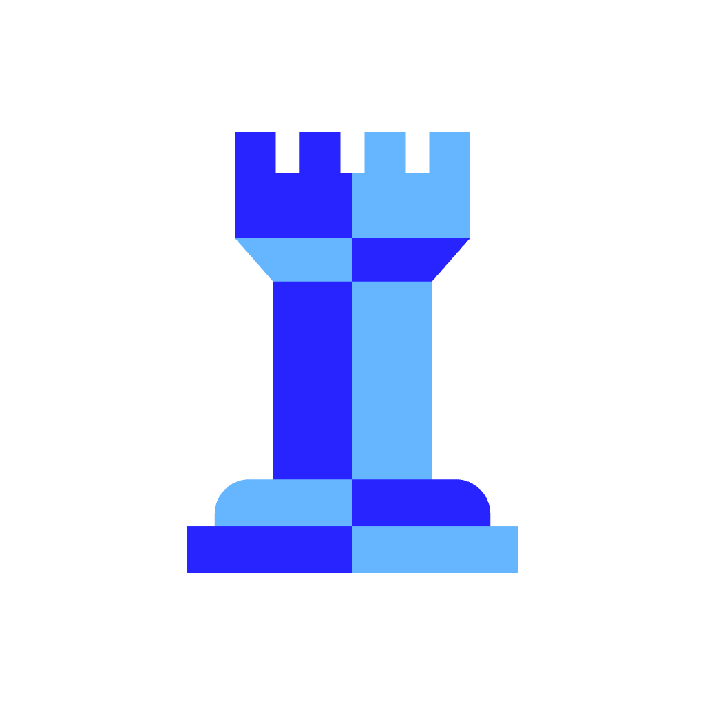

### Statemaster

<p align="center">
  
</p>

<p align="center">
  <strong>A state-machine database. One job, done exceptionally well:</strong><br>
  own the lifecycle of every entity — validate transitions, enforce guards, and remember everywhere each entity has been.
</p>

---

Your `status` column is lying to you. The transition logic is scattered across a dozen `if` statements, the audit trail is a pile of triggers nobody trusts, and every service that cares about a state change is polling or guessing. StateMaster is the database that was always missing: a purpose-built, queryable, durable store for entity lifecycles, with a validated change stream that makes the rest of your architecture reactive.

State is a first-class thing. It deserves its own database.

---

## Features

- **Enforced transition rules.** You declare states and which events move between them. StateMaster is the arbiter — callers fire *events*, never target states. Illegal moves are rejected at write time, not caught in a code review six months later.
- **Immutable, append-only history.** Every transition is a permanent record: from, to, event, actor, timestamp, and your context. The log is the source of truth; the current state is a fast projection over it.
- **Guards.** Attach named predicates to transitions. The engine evaluates them before committing; a failed guard is a typed rejection, not an exception.
- **Typed rejections.** `illegal_transition`, `guard_failed`, `version_conflict`, `unknown_machine` — the server tells you exactly what went wrong.
- **Optimistic concurrency.** Supply `expected_version` on a `Transition` to ensure you're operating on the state you think you are. Conflicts surface as `version_conflict`, not silent overwrites.
- **Multiple concurrent machines per entity.** State is keyed by `(entity_id, machine)`. One `Order` can simultaneously run a `fulfillment` machine, a `payment` machine, and a `fraud_review` machine — three lifecycles, one entity, independent positions.
- **Validated change stream.** Every committed transition produces a `ChangeRecord` with from/to/event/actor semantics and the effects the machine emitted. Cursor-based, at-least-once, replayable from the beginning. Subscribe from any point and rebuild downstream state.
- **Custom binary protocol, no Google tech.** Typed frames over TCP+TLS (`rustls`), MessagePack bodies, stateful sessions, pipelined commands, async push — the Postgres connection model with none of the HTTP overhead.

---

## Quickstart

### Start the server

```bash
docker compose -f deploy/docker-compose.yml up
```

The server is ready when `/readyz` returns 200:

```bash
curl -sf http://localhost:7633/readyz && echo "ready"
```

### Connect with smash

```bash
docker run --rm -it --network host \
  ghcr.io/pollystack/statemaster:latest \
  smash --addr localhost:7632 --token changeme
```

### Define a machine

```
smdb> define fulfillment v1 '{
  "states": ["pending","paid","packed","shipped","delivered","canceled"],
  "transitions": [
    {"event":"pay",     "from":"pending",                    "to":"paid"},
    {"event":"pack",    "from":"paid",                       "to":"packed"},
    {"event":"ship",    "from":"packed",                     "to":"shipped"},
    {"event":"deliver", "from":"shipped",                    "to":"delivered"},
    {"event":"cancel",  "from":["pending","paid","packed"],  "to":"canceled"}
  ]
}'
machine "fulfillment" v1 registered
```

### Run a transition

```
smdb> transition order_8412 fulfillment pay
paid (v1)

smdb> transition order_8412 fulfillment pack
packed (v2)

smdb> transition order_8412 fulfillment ship --expect-version 2 --ctx '{"carrier":"ups"}'
shipped (v3)

smdb> current order_8412 fulfillment
{ state: "shipped", version: 3, updated_at: "2026-06-08T12:00:00Z" }

smdb> history order_8412 fulfillment
seq  from     to       event   actor  ts
1    pending  paid     pay     …      2026-06-08T11:57:00Z
2    paid     packed   pack    …      2026-06-08T11:58:00Z
3    packed   shipped  ship    …      2026-06-08T12:00:00Z

smdb> \watch fulfillment
Watching change stream for machine "fulfillment"... (Ctrl-C to stop)
```

Try an illegal move:

```
smdb> transition order_8412 fulfillment pay
Rejection: illegal_transition — no transition for event 'pay' from state 'shipped'
```

---

## Architecture

```
  Clients
  ┌─────────────┐  ┌──────────────┐  ┌───────────────────┐
  │  smash      │  │  smdbctl     │  │  App / SDK        │
  │ (shell)     │  │  (admin CLI) │  │  (smdb-sdk-*)     │
  └──────┬──────┘  └──────┬───────┘  └────────┬──────────┘
         │                │                   │
         └────────────────┴───────────────────┘
                          │ TCP + TLS :7632
                          │ custom binary protocol
                          │ (MessagePack frames)
  ┌───────────────────────▼──────────────────────────────┐
  │                      smdbd                           │
  │                                                      │
  │  ┌─────────────────────────────────────────────────┐ │
  │  │  Connection layer (smdb-wire)                   │ │
  │  │  TLS termination · session state · framing      │ │
  │  └───────────────────────┬─────────────────────────┘ │
  │                          │                           │
  │  ┌───────────────────────▼─────────────────────────┐ │
  │  │  Engine (smdb-engine)                           │ │
  │  │  ┌──────────────┐  ┌──────────┐  ┌──────────┐  │ │
  │  │  │  API surface │  │ FSM core │  │ MVCC /   │  │ │
  │  │  │  four verbs  │  │ validate │  │ row locks│  │ │
  │  │  └──────────────┘  └──────────┘  └──────────┘  │ │
  │  └───────────────────────┬─────────────────────────┘ │
  │                          │                           │
  │  ┌───────────────────────▼─────────────────────────┐ │
  │  │  Storage engine (smdb-storage)                  │ │
  │  │  Buffer pool · Heap · B-tree indexes · WAL      │ │
  │  └───────────────────────┬─────────────────────────┘ │
  │                          │                           │
  │                  ┌───────▼───────┐                   │
  │                  │  Data on disk │                   │
  │                  │  WAL · heap   │                   │
  │                  └───────────────┘                   │
  │                                                      │
  │  Background workers: checkpointer · dispatcher       │
  └──────────────────────────────────────────────────────┘
                          │ push ChangeRecord frames
                          ▼
              Subscribers (same connection)
```

**Ports**

| Port | Purpose |
|------|---------|
| 7632 | Wire protocol (TCP+TLS). The `SMDB` keypad mnemonic. |
| 7633 | Metrics (`/metrics`) and health probes (`/healthz`, `/readyz`). |
| 7634 | Reserved for future replication traffic. |

---

## The four verbs

StateMaster exposes exactly four operations. Everything else is built on them.

### `define_machine`

Register a state-machine definition: the set of valid states, the transition table (event → from → to), and any guards or effects. Definitions are data, not code. Once registered, the machine is the authority for all entities that run it.

### `transition`

Fire an event against an entity. The engine looks up `(current_state, event)` in the machine definition, evaluates guards, and either commits the transition atomically or returns a typed rejection. The caller names the *event*; the engine decides the target state.

The write is atomic: transition record, updated projection, and outbox entries all land in one transaction or none of them do.

### `current`

Read an entity's current state and version. Hits the projection (a materialized cache of the log); no locks taken.

### `history`

Read an entity's full transition log — every move it has ever made on a machine, in order. The log is the source of truth; `current` is derived from it.

---

## Building from source

**Prerequisites:** Rust 1.87+, a C linker.

```bash
git clone https://github.com/pollystack/statemaster
cd statemaster
cargo build --release --workspace
```

Binaries land in `target/release/`: `smdbd`, `smdbctl`, `smash`.

**Run the daemon directly:**

```bash
./target/release/smdbd --config deploy/statemaster.toml
```

**Run tests:**

```bash
cargo test --workspace
```

**Build the Docker image:**

```bash
docker build -f deploy/Dockerfile -t statemaster:dev .
```

---

## Configuration

StateMaster is configured via a TOML file, environment variables, and command-line flags, in that order of precedence (flags win).

An annotated example is at [`deploy/statemaster.toml`](deploy/statemaster.toml). Key sections:

| Section       | Purpose                                                          |
|---------------|------------------------------------------------------------------|
| `[server]`    | `listen_addr` (wire, default `:7632`) and `metrics_addr` (`:7633`) |
| `[storage]`   | `data_dir` and `fsync_mode` (`synchronous` or `relaxed`)        |
| `[tls]`       | Paths to the PEM certificate chain and private key              |
| `[logging]`   | `level` (`info` default) and `format` (`json` or `text`)        |
| `[dispatcher]`| `interval_ms` — how often the outbox is drained (default `100`) |
| `[auth]`      | `tokens` list — bearer tokens accepted in the `Auth` handshake  |

**Environment variable override pattern:** `SMDB_<SECTION>_<KEY>` in uppercase, e.g. `SMDB_SERVER_LISTEN_ADDR=0.0.0.0:7632`.

### systemd

An example unit file is at [`deploy/statemaster.service`](deploy/statemaster.service). Install:

```bash
sudo cp deploy/statemaster.service /etc/systemd/system/
sudo systemctl daemon-reload
sudo systemctl enable --now statemaster
journalctl -u statemaster -f
```

---

## Observability

- **Health:** `GET http://localhost:7633/healthz` (liveness), `GET http://localhost:7633/readyz` (ready after WAL recovery and storage open).
- **Metrics:** `GET http://localhost:7633/metrics` — Prometheus format. Key metrics: `smdb_transitions_total`, `smdb_rejections_total{code}`, `smdb_transition_duration_seconds`, `smdb_outbox_depth`, `smdb_changestream_lag_seconds`, `smdb_active_connections`.
- **Logs:** structured JSON on stdout, with `request_id` and `transition_id` fields for correlation.
- **Admin introspection:** `smdbctl status`, `smdbctl machine describe <name>`, `smdbctl entity <id>`, `smdbctl outbox`.

---

## Tooling

| Binary    | Role                                                                              |
|-----------|-----------------------------------------------------------------------------------|
| `smdbd`   | The daemon. Holds the engine, storage, connection layer, and background workers.  |
| `smdbctl` | Admin and automation CLI (`kubectl` / `etcdctl` style). For scripts and CI.       |
| `smash`   | Interactive shell — the `psql` analog. REPL, `\` meta-commands, definition-aware autocomplete, `\watch <machine>` to tail the live change stream. |

---

## Wire protocol

The full driver contract — frame format, every message type, handshake sequence, rejection codes, pipelining, subscription model, reconnection — is documented in [PROTOCOL.md](PROTOCOL.md).

If you are building a driver or SDK in any language, start there.

---

## Repo layout

```
statemaster/
├── Cargo.toml                # workspace
├── crates/
│   ├── smdb-core/            # pure FSM logic — definitions, guards, planner (no I/O)
│   ├── smdb-proto/           # frame codec + message types
│   ├── smdb-storage/         # StorageEngine trait + implementations
│   ├── smdb-wal/             # write-ahead log (phase 2)
│   ├── smdb-engine/          # ties core + storage + concurrency together
│   ├── smdb-wire/            # connection layer, sessions, auth, stream serving
│   ├── smdb-sdk/             # Rust client SDK (reference driver)
│   ├── smdbd/                # daemon binary
│   ├── smdbctl/              # admin & automation binary
│   └── smash/                # interactive shell binary
├── deploy/
│   ├── Dockerfile            # multi-stage build
│   ├── docker-compose.yml    # one-command local stack
│   ├── statemaster.service   # systemd unit
│   └── statemaster.toml      # annotated example config
├── PROTOCOL.md               # wire protocol spec (driver contract)
└── PROJECT.md                # architecture and design document
```

---

## License

[AGPL-3.0](LICENSE)
